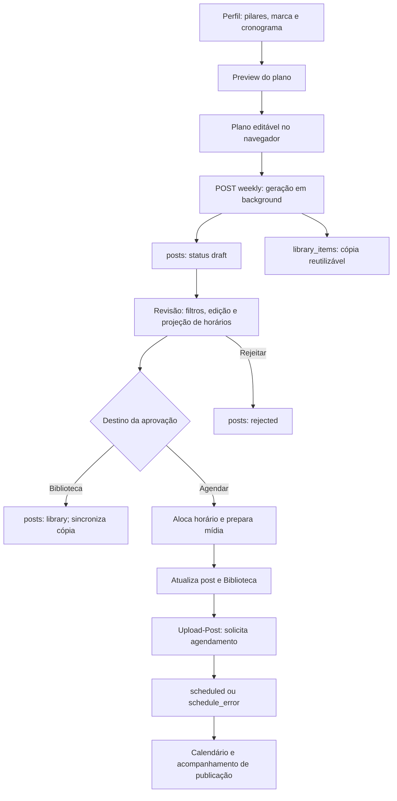

# Funcionalidade Revisão: fluxos de dados e alterações propostas

Revisão técnica de 24/09/2026. Nenhuma mudança funcional ou chamada real de geração, agendamento ou publicação foi realizada.

## Fluxo atual

- **Plano:** `/preview` lê perfil, regras e atividade recente. O plano editado fica em estado React até `/weekly`.
- **Geração:** `/weekly` responde imediatamente. A execução cria os rascunhos e cópias na Biblioteca. O andamento da geração manual fica em um `Map` no processo do backend, consultado por perfil.
- **Fila de revisão:** `/drafts` consulta `posts` por usuário e `status == draft`; os filtros de perfil, geração, pilar, campanha e Feed/Stories são aplicados no frontend.
- **Edição:** mídia, legenda, layout e data usam PATCHs separados. Diversos caminhos chamam `syncDraftToLibrary`; falhas dessa sincronização são registradas, mas não bloqueiam a operação.
- **Datas:** a projeção não reserva horário. A reserva prática só aparece quando a aprovação grava `scheduledFor` no post.
- **Aprovação:** o serviço prepara mídia, altera o post e sincroniza a Biblioteca; depois a rota chama o agendador externo.
- **Calendário:** consulta posts e tem sua própria seleção de itens disponíveis da Biblioteca. Não é simplesmente outra apresentação do estado React da Revisão.

## P1 — Resultado de aprovação incorreto

`scheduleApprovedPost` pode retornar `status: schedule_error` quando o provedor falha ou não fornece um identificador de job. A rota de aprovação ignora esse retorno e responde `success: true`. O frontend conta sucesso e remove o rascunho. A Biblioteca já pode ter sido marcada como agendada antes da tentativa externa.

**Proposta:** a resposta deve conter o resultado efetivo: `postId`, estado, data, identificador externo e erro recuperável. Distinguir “Aprovado”, “Agendamento em andamento”, “Agendado” e “Falha ao agendar”. Oferecer nova tentativa da etapa de agendamento sem aprovar/exportar novamente. Atualizar a Biblioteca a partir do resultado confirmado.

**Aceite:** falha do provedor nunca gera mensagem “Agendado”; o conteúdo continua acessível numa fila de pendências.

**Evidência:** `backend/src/routes/auto-generate.js:240`; `backend/src/services/postService.js:752`; `frontend/src/app/dashboard/review/page.tsx:974`. Comportamento da rota reproduzido com agendador simulado.

## P1 — Transições sem proteção suficiente contra repetição

`requireOwnedDraft` verifica existência e proprietário, mas não exige `status == draft`. `approveDraftPost` também não faz essa checagem. O caminho de agendamento futuro não deduplica por operação antes de chamar o provedor. A rejeição simplesmente grava `rejected`, sem tratar cancelamento externo.

**Riscos:** aba desatualizada ou duas requisições podem reapresentar um conteúdo já agendado ao provedor. Uma rejeição tardia pode marcar como rejeitado um post cujo job externo continua existindo. Há proteção transacional na execução local (`claimPostExecution`), mas ela não resolve a aprovação/agendamento futuro.

**Proposta:** validar transições no backend, exigir versão esperada do rascunho e adquirir a operação em transação. Usar chave de idempotência para aprovação e agendamento. Um item já agendado deve direcionar para o fluxo de cancelamento, não para rejeição de rascunho.

**Aceite:** dois pedidos de aprovação do mesmo item produzem um único job; rejeitar pela rota de rascunho um item agendado retorna conflito sem alterar o post.

**Evidência:** `backend/src/routes/auto-generate.js:35`, `:342`; `backend/src/services/contentGeneratorService.js:2099`, `:2247`. Testes isolados confirmaram que posts com estado `scheduled` atravessam ambas as rotas; duplicação real de jobs não foi executada.

## P1 — Lotes não conciliam sucesso parcial

`approveDraftIds` processa sequencialmente, mas só remove os IDs da tela depois que todo o laço termina. Se A for aprovado e B falhar, A permanece localmente selecionável e o restante não é processado. A mensagem de erro não informa o resultado por item.

**Proposta:** registrar e atualizar cada resultado individualmente; recarregar os estados canônicos ao finalizar; exibir aprovados, falhos e não processados, com nova tentativa somente dos pendentes.

**Aceite:** num lote de três com falha no segundo, o primeiro nunca reaparece como rascunho aprovável.

**Evidência:** `frontend/src/app/dashboard/review/page.tsx:943`.

## P1 — Aprovação pode usar dados anteriores à edição visível

A aprovação salva a legenda pendente, mas não faz o mesmo com `editingSchedule`. Layouts inline usam um único timer global de 500 ms (`window._inlinePremiumTimeout`): editar outro slide rapidamente cancela o salvamento anterior. Falhas desse PATCH aparecem apenas no console. Não há barreira entre esse salvamento pendente e aprovar.

**Proposta:** rascunho de edição com versão, indicador “Salvando/Salvo/Falhou”, fila por post/slide e uma operação “Salvar e aprovar” que inclua todos os campos ou aguarde os PATCHs confirmados. Preservar tentativas que falharam.

**Aceite:** a versão aprovada contém exatamente legenda, data e enquadramento mostrados na confirmação; editar dois slides rapidamente persiste ambos.

**Evidência:** `frontend/src/app/dashboard/review/page.tsx:789`, `:969`, `:1233`.

## P2 — Biblioteca e Revisão têm cópias com sincronização parcial

A geração cria `library_items` e `posts` em operações separadas. A edição pela Revisão tenta sincronizar a Biblioteca, mas várias falhas são suprimidas. A rejeição muda apenas o post, preservando a cópia reutilizável. O fallback de vínculo busca correspondência de HTML ou sobreposição de URLs, que pode associar conteúdos distintos que reutilizam a mesma imagem.

**Proposta:** identificar explicitamente conteúdo e revisão (`contentId`, `revision`), manter vínculo determinístico e separar estado editorial do conteúdo do estado de cada publicação. Usar uma fila persistente de sincronização para falhas e mostrar pendências. Explicar “Remover da Revisão; manter na Biblioteca” ou oferecer arquivamento coerente das duas representações.

**Aceite:** mudanças têm versão rastreável; falhas de sincronização são recuperadas; compartilhar uma imagem não faz dois conteúdos se sobrescreverem por associação heurística.

**Evidência:** `backend/src/services/contentGeneratorService.js:922`, `:1800`, `:1884`, `:2206`, `:2247`.

## P2 — Geração manual não tem acompanhamento durável

O `runningJobs` é um `Map` local indexado por perfil. Reiniciar o processo perde o andamento; múltiplas instâncias não compartilham a trava. Existe telemetria em `generation_runs`, mas ela não substitui um job persistente. A rota manual não fornece `generationRunId` às proteções já existentes por slot.

No frontend, o polling não tem cleanup de desmontagem. O limite de tentativas é verificado dentro do caminho de resposta bem-sucedida: erros de rede repetidos passam pelo `catch` e podem manter o polling além do limite anunciado.

**Proposta:** retornar `jobId` persistido, acompanhar por job e registrar estados por item. Recuperar após recarregar a tela. Usar trava com expiração e identificadores de execução/slot. Encerrar polling por tempo total, inclusive em erro, e limpar timers ao sair.

**Aceite:** recarregar a tela recupera o andamento; reiniciar o backend deixa um estado recuperável; retomar não recria slots concluídos.

**Evidência:** `backend/src/routes/auto-generate.js:23`, `:89`; `frontend/src/app/dashboard/review/page.tsx:865`; `backend/src/services/contentGeneratorService.js:1414`.

## P2 — Horários projetados e indicadores não são garantias

A alocação consulta horários e retorna o próximo livre, sem uma reserva transacional compartilhada. Duas aprovações simultâneas podem encontrar a mesma vaga. A projeção inclui rascunhos sem data de todos os tipos, inclusive stories pausados, embora estes não possam ser agendados.

Os indicadores da tela também misturam escopos: conflitos usam apenas o minuto, sem perfil; rascunhos com data e posts com `schedule_error` entram na contagem semanal; “Todos os perfis” usa como meta o cronograma de um único perfil. Assim, rascunhos podem reduzir o número de lacunas antes de estarem agendados, e marcas distintas podem aparecer em conflito.

**Proposta:** reserva transacional por perfil e horário; projeção da seleção aprovável com aviso “Previsão”; separar planejado, confirmado e falho nos indicadores. Calcular conflitos e metas por perfil antes de agregar.

**Aceite:** aprovações simultâneas respeitam a política de ocupação; dois perfis no mesmo horário não geram falso conflito; falha de agendamento não conta como cobertura confirmada.

**Evidência:** `backend/src/services/slotAllocationService.js:29`, `:58`; `frontend/src/app/dashboard/review/page.tsx:746`, `:1916`.

## P2 — Escopo e origem do plano precisam permanecer explícitos

O perfil da Revisão é estado local, inicializado a partir do seletor global, mas não compartilha diretamente o contexto dele. Requisições de preview não descartam respostas antigas: ao trocar rapidamente de perfil, uma resposta anterior pode sobrescrever o plano. A geração usa `preview.profile.id`, enquanto as diretrizes de geração acompanham o perfil local selecionado.

Além disso, `/drafts/approve-all-week` filtra os rascunhos pelo perfil, mas não pela semana, apesar do nome. A tela atual usa aprovação individual por IDs, portanto essa rota não deve ser confundida com o botão “Aprovar seção”.

**Proposta:** um contexto de perfil compartilhado; associar plano, diretrizes e resposta a uma mesma versão/perfil; descartar respostas obsoletas. Na rota em lote, receber IDs explícitos ou intervalo de datas validado e devolver o escopo efetivo.

**Evidência:** `frontend/src/app/dashboard/review/page.tsx:543`, `:648`, `:855`; `backend/src/routes/auto-generate.js:258`.

## O que já está melhor no código atual

- “Aprovar seção” usa os itens visíveis e exclui stories pausados.
- A confirmação em lote apresenta perfil, formato e campanha.
- Limpar a data manual envia e aceita `scheduledFor: null`.
- A pausa de stories é verificada também na aprovação e no agendamento no backend.
- Falha de exportação HTML impede aprovação para agendamento antes da mudança principal de estado.
- A geração manual solicita `skipAutoApprove: true`.

Esses pontos não devem ser tratados como pendências antigas ainda intactas.

## Validação e ordem de execução

Executados **35 testes existentes**, todos aprovados: `draftLibrarySync`, `slotAllocation`, `post-flow` e `autoApprover`. Executadas também **três reproduções temporárias**, com Firebase em memória e serviços simulados, confirmando os contratos problemáticos das rotas. O arquivo temporário foi removido. Esses testes não certificam concorrência real ou o comportamento do provedor externo.

Ordem recomendada:

1. Corrigir retorno da aprovação, transições/idempotência e conciliação de lotes.
2. Garantir que todas as edições estejam confirmadas antes de aprovar.
3. Tornar vínculos, sincronização, jobs e reservas de horários recuperáveis.
4. Ajustar contexto de perfil, indicadores e linguagem dos estados.

O teste de aceite principal deve percorrer: editar dois slides e data; aprovar um lote com falha parcial; recarregar; repetir apenas o item falho; conferir uma única publicação por item e a mesma versão na Revisão, Biblioteca e Calendário.
